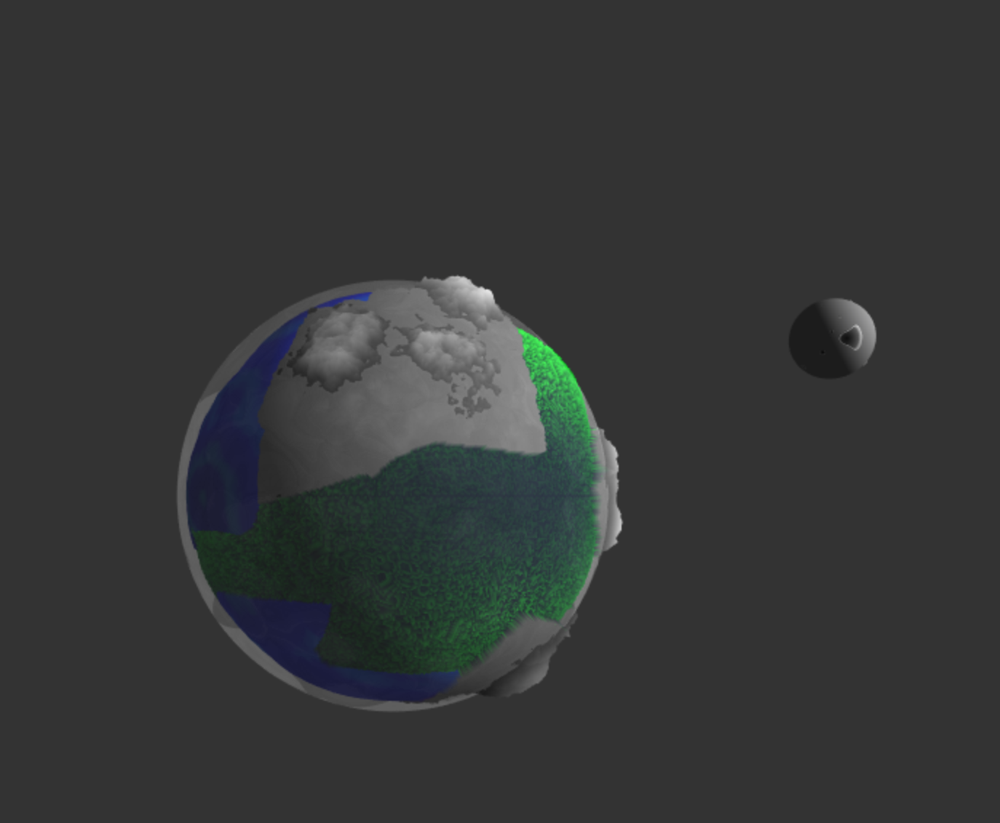
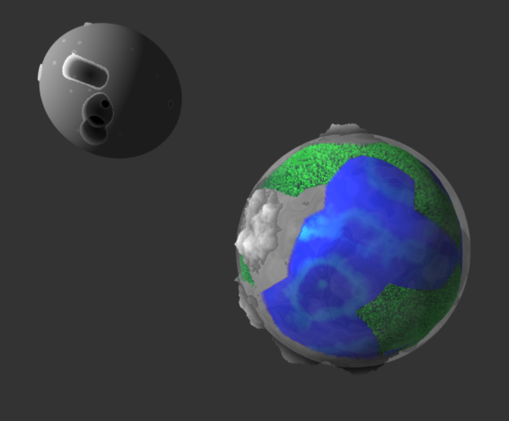
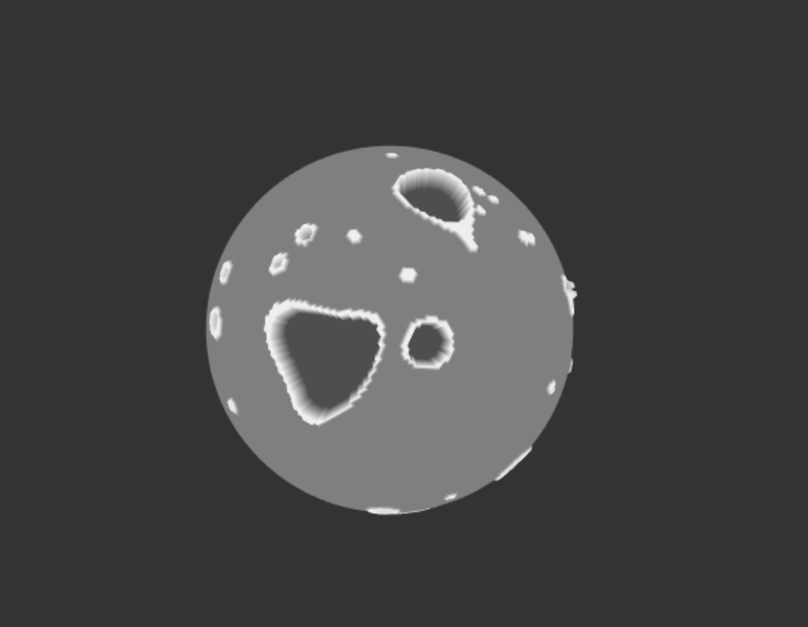

# CIS 566 Project 1: Noisy Planets

Name: Chloe Snyder
Pennkey: csny

github.io demo: https://chloesnyder.github.io/homework-1-noisy-planets-chloesnyder/

For reference, here is a planet made by your TA Dan last year for this
assignment:

## External Resources
Exact usages are cited in code comments
- [Curl Noise](https://petewerner.blogspot.com/2015/02/intro-to-curl-noise.html)
- [GPU Gems Chapter on Perlin Noise](http://developer.download.nvidia.com/books/HTML/gpugems/gpugems_ch05.html)
- [Worley Noise Implementations](https://thebookofshaders.com/12/)
- [Some noise functions taken from/modified from shadertoy](https://www.shadertoy.com/view/4dS3Wd)
- [Value noise](http://www.iquilezles.org/www/articles/morenoise/morenoise.htm)
- [Modified an FBM from here](https://shaderfrog.com/app/editor)
- [RGB Color picker](https://www.rapidtables.com/web/color/RGB_Color.html)

## Explanation of controls
- Light_x, light_y, light_z = move light position
- Tectonic plates = changes scalar value of worley noise grid used to generate continents and oceans.
- Rotation Speed = speed up or slow down rotation of planet and moon around planet (moon always orbits planet at 1/27th the speed of the planet in order to simulate lunar month)
- Animate = Uncheck this to stop rotation
- Clouds = uncheck this to turn atmosphere off and just look at the planet

## Explanation of Techniques

- Planet:
    - The planet is generated from worley noise, perlin noise, value noise and a simple hash function
    - Worley noise: 3D worley noise is used to generate "tectonic plates". A 3D grid is created from (-1,1) in 3 dimensions. The user controls the scalar value of the grid from "tectonic plates" on the GUI. The worley noise function takes in a vertex and determines the closest grid cell to this vertex, and how far the vertex is from the cell (the minimum distance). Temporarily, the coordinate of the closest grid cell used to color the vertex via the colorize function. The result is a voronoi-esque sphere diagram. These colors are overwritten in the biome function. minDist is saved as a global value for later use.
    - The biomes function checks what "color" the vertex is in order to determine whether this vertex falls in a mountain, ocean, or forest biome. Each biome uses noise to compute a t value by which the vertex position is displaced along its normal.
    - Forest biome: The forest biome calculates displacement by using a simple hash function and noise function. The fragment is recolored using the function greenPalette;
    - Mountain biome: The mountain biome uses an fbm of a 3D value noise function to calculate displacement. Displacement is remapped within worley noise using the minimum distance in order to avoid jagged continent edges. The fragment is recolored using the function winterPalette;
    - Ocean biome: The ocean biome uses a lower frequency fbm. A float isWater is set to true and the fragment shader calculates blinn-phong specular highlight for water only.
- Moon:
    - 50 points are uniformly sampled on the sphere to represent craters
    - Noise is used to calculate theta and phi offsets to introduce randomness to the sampling
    - A radius is generated for each point by interpolating between the theta offset and phi offset. The radius is updated later to add some "noise" based on the distance from the vertex to each of the sphere samples in order to generate non-uniform craters (i.e., craters are not all perfect circles)
    - Crater depth is created using a sin curve to displace the vertex along its normal if the vertex falls within the noisey radius
    - A slight peak is calculated if the vertex falls between the radius and the radius + some threshold
    - The moon rotates around the planet at 1/27th the speed of the planet's rotation. The moon rotates about its own axis at this speed as well.  This is to simulate a lunar month to an earth day (It takes the moon 27 days to rotate the earth).
- Atmosphere
    - Clouds are created using 3D curl noise (which uses an fbm of Perlin Noise as an internal noise function) on the vertex shader
    - 4D perlin noise is used in the fragment shader to generate alpha values that vary with time. This gives the effect of an initially very foggy planet that ebbs and flows as time goes on, so at times the entire planet is very foggy, at other times it's barely foggy (pausing animation but keeping clouds turned on will still animate the clouds).
    

